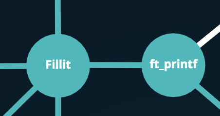

# 42 Cursus

ft_printf is the first project of the algo branch of the cursus 42. The is about recode the real function printf.

# 42-ft_printf

Are you tired of using alternatively ft_putstr and ft_putnbr for your displays? You don’t have the right to use printf? Re-code your own! This is a good time to discover a C feature: variadic functions, and to train your display options management skills. You will then be able to use your printf in all future projects.

for more information Read the PDF subject in the folder ressources/subject

# Compiling and running
Run the command `make` at the root of the repo then you can't run the program in solo.
You just have a libft_printf.a (it's an additionnal library).

